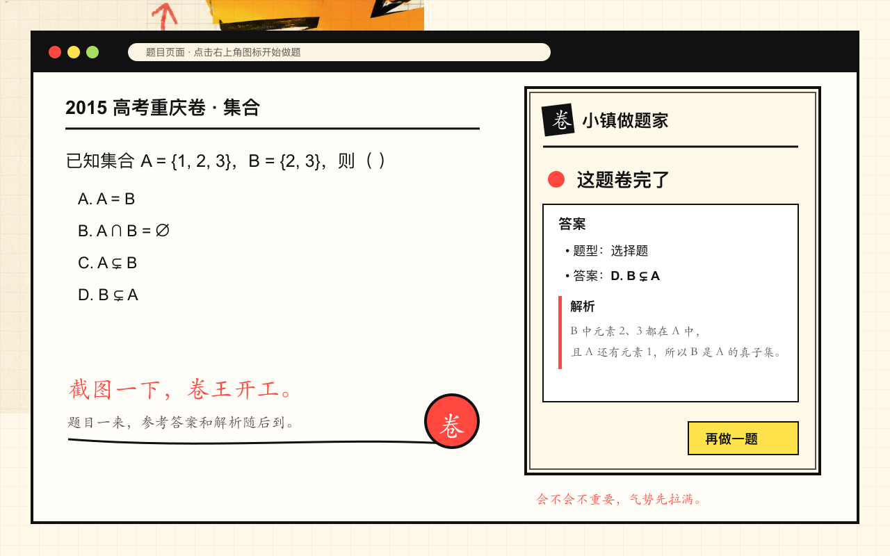

# 小镇做题家

小镇做题家把“看到题、截个图、去问 AI”收成 Chrome 工具栏里的一个按钮。

打开题目，点一下“卷”，它只截取当前可见区域，并在浏览器弹窗里返回题目转写、题型、参考答案和简短解析。选择、判断、填空、简答和计算题都可以直接试；题干没截全或图太糊时，它会明确告诉你需要补什么。

[从 Chrome 网上应用店安装](https://chromewebstore.google.com/detail/oaklibljpcpnkbhoegfjingcdebjkkjp) · [查看介绍与 ZIP 手动安装](https://boringmax.com/countryboy/)



它适合卡住时迅速换个思路，也适合做完后快速核对。整个过程留在当前标签页，题目不需要手动搬运。

## 使用方式

1. 打开题目，让完整题干出现在当前窗口里。
2. 点击扩展图标。它只会在这一次点击时截取当前标签页的可见区域。
3. 等弹窗给出转写、题型、参考答案和解析；关掉再打开，刚才的结果还在，也可以取消重做。

扩展会把截图、页面标题和地址发送到配置的后端。数据处理说明见[隐私政策](https://boringmax.com/countryboy/privacy.html)。

## 从源码运行

仓库包含 Chrome Manifest V3 扩展和 FastAPI 参考后端。需要 Python 3.11+；不配置 Gemini 密钥时，后端用 MockAnalyzer 返回示例结果，可用来检查截图上传和轮询流程。

```bash
cd backend
python3 -m venv .venv
source .venv/bin/activate
python3 -m pip install -r requirements.txt
uvicorn app.main:app --host 127.0.0.1 --port 8000
```

然后在 `extension/src/config.js` 设置本地后端地址，并同步修改 `extension/manifest.json` 的 `host_permissions`。打开 `chrome://extensions`，开启开发者模式，选择“加载已解压的扩展程序”，加载仓库里的 `extension/` 目录。

要让后端真正分析题目，在 `backend/.env` 中设置 `GEMINI_API_KEY`；配置示例见 [`backend/.env.example`](backend/.env.example)。密钥只放后端，不要写进扩展。部署到公网时还需要为 API 加访问控制。

参考后端把任务放在内存里，重启后会清空。扩展只截可见区域，不读取整页 DOM。

开发与验证命令见 [`scripts/verify.sh`](scripts/verify.sh)，实现说明见 [`docs/CODEX_HANDOFF.md`](docs/CODEX_HANDOFF.md)。

## 许可

项目代码采用 [MIT 许可证](LICENSE)。随扩展打包的第三方 KaTeX 素材保留其自身许可证，见 [`extension/vendor/katex/LICENSE`](extension/vendor/katex/LICENSE)。
